# **Practical 1. Basic Logic Gates Implementation**

**Aim**: To understand the basic working of logic gates and verify their truth tables using Logisim.
**Tasks**
- Design and simulate basic logic gates (AND, OR, NOT) using Logisim.
- Verify the truth tables for each gate using different input combinations.

Digital systems work on binary values, which are 0 and 1. These values represent low and high voltage levels in real electronic circuits. Logic gates are the smallest and most basic units of digital electronics. Every complex digital circuit, including processors and memory, is built using these basic gates.

In this practical, three basic gates are studied: AND, OR, and NOT. The AND gate performs multiplication-like operation where the output becomes 1 only if both inputs are 1. If any input is 0, the output becomes 0. This behavior shows how conditions work in digital logic. The OR gate performs addition-like operation where output becomes 1 if any one input is 1. The NOT gate works differently because it has only one input and its function is to invert the input value.

In Logisim, input pins are used to give binary values manually. By changing inputs step by step and observing output pins, the truth table is verified. This practical helps in forming a strong base for understanding all upcoming digital circuits.

**Truth Tables**

**AND Gate**

| A   | B   | Output |
| --- | --- | ------ |
| 0   | 0   | 0      |
| 0   | 1   | 0      |
| 1   | 0   | 0      |
| 1   | 1   | 1      |

**OR Gate**

| A   | B   | Output |
| --- | --- | ------ |
| 0   | 0   | 0      |
| 0   | 1   | 1      |
| 1   | 0   | 1      |
| 1   | 1   | 1      |

**NOT Gate**

| A   | Output |
| --- | ------ |
| 0   | 1      |
| 1   | 0      |

  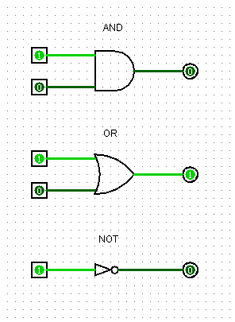
  
<b>Figure 1.1:</b> AND, OR and NOT gate implementation

---

# **Practical 2. NAND and NOR as Universal Gates**

**Aim**: To study NAND and NOR gates and verify their universality.
**Tasks**
* Implement and simulate NAND and NOR gates.
* Construct AND, OR, and NOT gates using only NAND and NOR gates.
NAND and NOR gates are called universal gates because any logic function can be implemented using only one type of these gates. This property is very useful in hardware design because it simplifies manufacturing and reduces cost.

The NAND gate is the inverse of AND gate, meaning its output is opposite of AND output. Similarly, NOR gate is the inverse of OR gate. In this practical, first the truth tables of NAND and NOR gates are verified. Then, by connecting inputs in a specific way, NOT gate is formed. After that, AND and OR gates are constructed using combinations of NAND and NOR gates.

**NAND Gate Truth Table**

| A   | B   | Output |
| --- | --- | ------ |
| 0   | 0   | 1      |
| 0   | 1   | 1      |
| 1   | 0   | 1      |
| 1   | 1   | 0      |

**NOR Gate Truth Table**

| A   | B   | Output |
| --- | --- | ------ |
| 0   | 0   | 1      |
| 0   | 1   | 0      |
| 1   | 0   | 0      |
| 1   | 1   | 0      |

  
  
<b>Figure 2.1:</b> AND, OR, NOT gates using NAND and NOR

---

# **Practical 3. Boolean Expression Simplification and Circuit Design**

**Aim**: To simplify Boolean expressions and design optimized logic circuits.
**Tasks**
* Simplify a given Boolean expression using Boolean algebra.
* Design and simulate the simplified circuit in Logisim.

Boolean expressions are mathematical representations of logic circuits. If expressions are not simplified, the resulting circuit may use more gates, more power, and more space. Boolean algebra provides rules that help reduce expressions without changing output behavior.

In this practical, Boolean laws such as identity law, complement law, associative law, and absorption law are applied step by step. Each step reduces complexity while keeping logic same. After simplification, the reduced expression is implemented in Logisim.

### **Boolean Expression Simplification**

Original expression:

$F = \overline{A} \, \overline{B} \, \overline{C} + \overline{A} \, B \, \overline{C} + A \, \overline{B} \, \overline{C} + A \, B \, C$

Simplifying:

$F = \overline{A} \, \overline{B} \, \overline{C} + \overline{A} \, B \, \overline{C} + A \, \overline{B} \, \overline{C} + A \, B \, C \quad (\text{Original expression})$

$F = \overline{C} (\overline{A} \, \overline{B} + \overline{A} \, B + A \, \overline{B}) + A \, B \, C \quad (\text{Factor out } \overline{C})$

$F = \overline{C} (\overline{A} (\overline{B} + B) + A \, \overline{B}) + A \, B \, C \quad (\text{Factor } \overline{A}, \text{use } \overline{B}+B=1)$

$F = \overline{C} (\overline{A} + A \, \overline{B}) + A \, B \, C \quad (\text{Simplify})$

$F = \overline{C} (\overline{A} + \overline{B}) + A \, B \, C \quad (\text{Apply consensus theorem})$

$F = \overline{A} \, \overline{C} + \overline{B} \, \overline{C} + A \, B \, C \quad (\text{Final simplified expression})$

The circuit is tested by applying all input combinations and comparing output with the original expression. This practical helps in understanding optimization and efficient circuit design.

  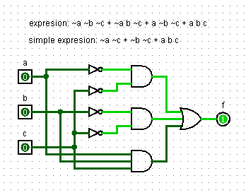
  
<b>Figure 3.1:</b> Boolean expression simplification

---

# **Practical 4. Karnaugh Map Simplification**

**Aim**: To simplify Boolean expressions using Karnaugh Map method.
**Tasks**
- Use a Karnaugh map to simplify a 3-variable Boolean expression.
- Design the simplified circuit in Logisim and verify its functionality.

Karnaugh Map is a graphical technique used to simplify Boolean expressions easily and accurately. It reduces chances of mistakes compared to algebraic method. In this practical, the truth table is first prepared and output values are placed into the K-map.

Adjacent 1s are grouped according to K-map rules. Each group represents a simplified term. These terms are combined to get the final simplified expression. This expression is then implemented in Logisim and tested.

**Expression from K-map:**

$F = \overline{A} \, C + \overline{B} \, C + A \, B \, \overline{C}$

This is the minimal simplified form. It means:

* $\overline{A} \, C$ covers the cases where A = 0 and C = 1.
* $\overline{B} \, C$ covers the cases where B = 0 and C = 1.
* $A \, B \, \overline{C}$ covers the case where A = 1, B = 1, and C = 0.

| A   | B   | C   | F   |
| --- | --- | --- | --- |
| 0   | 0   | 0   | 0   |
| 0   | 0   | 1   | 1   |
| 0   | 1   | 0   | 0   |
| 0   | 1   | 1   | 1   |
| 1   | 0   | 0   | 0   |
| 1   | 0   | 1   | 1   |
| 1   | 1   | 0   | 1   |
| 1   | 1   | 1   | 0   |

So the simplified expression captures **all output 1 conditions** efficiently without repeating terms unnecessarily. This expression is implemented in Logisim, and testing with all input combinations shows it produces the correct outputs exactly as in the truth table.

  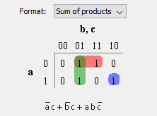
  
<b>Figure 4.1:</b> Karnaugh Map

This shows the exact positions of 1s that lead to the simplified expression.

  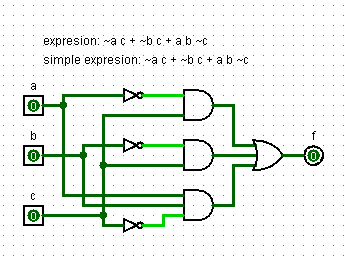
  
<b>Figure 4.2:</b> Simplified expression

---

# **Practical 5. Half Adder and Full Adder Design**

**Aim**: To design and understand half adder and full adder circuits.
**Tasks**
- Design and simulate a half adder circuit using basic logic gates.
- Expand the design to simulate a full adder and test it with all possible input combinations.

**Overview**

| *      | **Half Adder** | **Full Adder** |
| ------ | -------------- | -------------- |
| INPUT  | A, B           | A, B, CARRY    |
| OUTPUT | SUM, CARRY     | SUM, CARRY     |

Half Adder is adding 2 bit and returning SUM and CARRY

As this Full Adder name show is come from combination of 2 Half Adder

$Full Adder = Half Adder + Half Adder$

When first time  Half Adder operate for Full Adder it make operation on A and B and get SUM and first OUT CARRY

then on SUM and remain IN CARRY perform second Half Adder operation

next it come up with one final SUM and final OUT CARRY

now we get the last answer as final SUM and final OUT CARRY

---

**5.1. Half Adder**

Adders are used to perform arithmetic operations in digital systems. A half adder adds two bits and produces sum and carry. However, it cannot accept carry from previous stage. To overcome this limitation, full adder is used.

Half Adder Truth Table

| A   | B   | Sum | Carry |
| --- | --- | --- | ----- |
| 0   | 0   | 0   | 0     |
| 0   | 1   | 1   | 0     |
| 1   | 0   | 1   | 0     |
| 1   | 1   | 0   | 1     |

  
  
<b>Figure 5.1:</b> Half Adder

---

**5.2. Full Adder**

Full adder adds three bits: two input bits and one carry input. It is constructed using two half adders and an OR gate. All possible input combinations are tested to verify correctness.

Full Adder Truth Table

| A   | B   | Cin | Sum | Cout |
| --- | --- | --- | --- | ---- |
| 0   | 0   | 0   | 0   | 0    |
| 0   | 1   | 0   | 1   | 0    |
| 1   | 0   | 0   | 1   | 0    |
| 1   | 1   | 0   | 0   | 1    |

  
  
<b>Figure 5.2:</b> Full Adder

---

# **Practical 6. 4-Bit Binary Adder / Subtractor**

**Aim**: To design a circuit that performs 4-bit addition and subtraction.
**Tasks**
- Design and simulate a 4-bit binary adder using full adders.
- Extend the design to create a 4-bit adder/subtractor circuit and simulate it in Logisim.

**6.1. 4-bit adder**
4-bit adderis designed by connecting four full adders in series. Each adder handles one bit and passes carry to the next stage.

  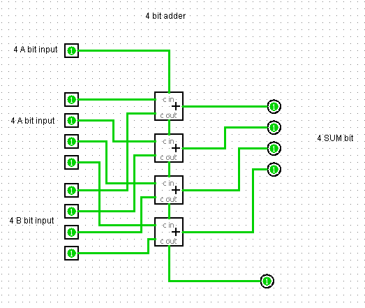
  
<b>Figure 6.1:</b> 4-bit Adder

---

**6.2. 4-bit Adder/Subtractor**
in subtraction, 2’s complement method is used where the second number is complemented and 1 is added.

A control input selects addition or subtraction mode. The output is verified for multiple input combinations, which helps in understanding arithmetic logic unit operation.

Below _Figure 6.2_ that XOR is doing that 2's complement operation on that input if that Control input is selected On that indicate subtraction operation

  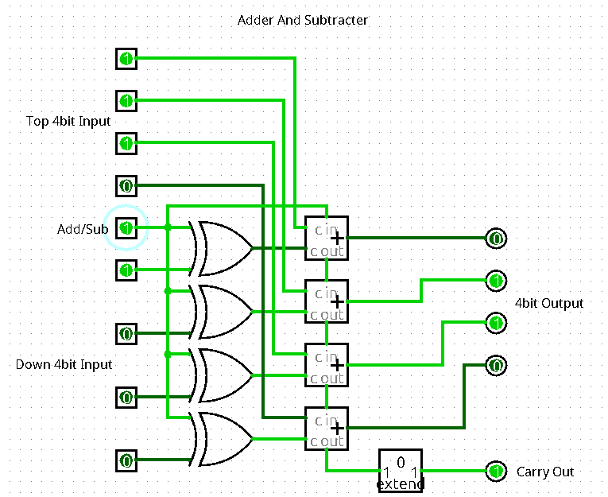
  
<b>Figure 6.2:</b> 4-bit Adder/Subtractor

---

# **Practical 7. Multiplexer and Demultiplexer Design**

**Aim**: To study data selection and data distribution circuits.
**Tasks**
- Design and simulate a 4-to-1 multiplexer.
- Design a 1-to-4 demultiplexer circuit and test its functionality in Logisim.

In electronics, a **multiplexer** (**mux**), also known as a **data selector**, is a device/digital circuit that selects between several analog and digital input signals and forwards the selected input to a single output line.

The selection is directed by a separate set of digital inputs known as select lines.

A multiplexer / demultiplexer of $2^n$ inputs has $n$ select lines, which are used to select which input line to send / receive to the output.

A **demultiplexer** (**demux**) is a device/digital circuit that takes a single input signal and selectively forwards it to one of several output lines. A multiplexer is often used with a complementary demultiplexer on the receiving end

In this practical Selection lines are changed to observe output changes. This practical show how data routing is work in digital systems.

---

**7.1. Multiplexer**

Multiplexer selects one input from many inputs using selection lines. It works like a
digital switch.

4-to-1 Multiplexer Truth Table (Inputs: I0, I1, I2, I3; Select: S1, S0; Output: Y)

| S1  | S0  | Y   |
| --- | --- | --- |
| 0   | 0   | I0  |
| 0   | 1   | I1  |
| 1   | 0   | I2  |
| 1   | 1   | I3  |

  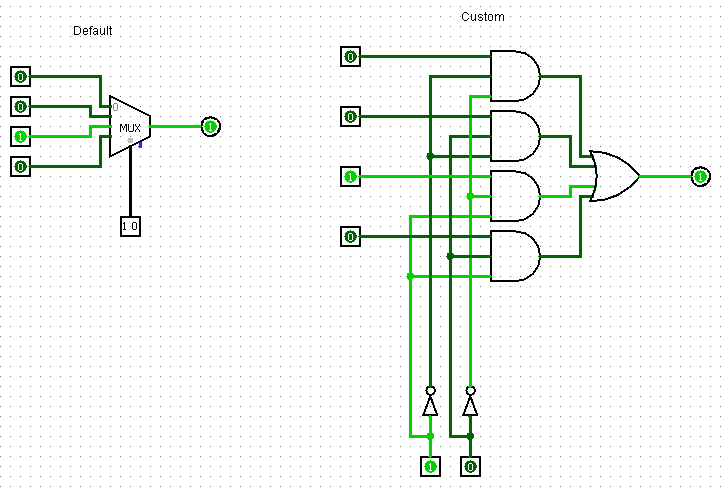
  
<b>Figure 7.1:</b> Multiplexer

---

**7.2. Demultiplexer**

Demultiplexer takes one input and sends it to one of many outputs.
1-to-4 Demultiplexer Truth Table (Input: D; Select: S1, S0; Outputs: Y0, Y1, Y2, Y3)

| S1  | S0  | D   | Y0  | Y1  | Y2  | Y3  |
| --- | --- | --- | --- | --- | --- | --- |
| 0   | 0   | 1   | 1   | 0   | 0   | 0   |
| 0   | 1   | 1   | 0   | 1   | 0   | 0   |
| 1   | 0   | 1   | 0   | 0   | 1   | 0   |
| 1   | 1   | 1   | 0   | 0   | 0   | 1   |
| 0   | 0   | 0   | 0   | 0   | 0   | 0   |
| 0   | 1   | 0   | 0   | 0   | 0   | 0   |
| 1   | 0   | 0   | 0   | 0   | 0   | 0   |
| 1   | 1   | 0   | 0   | 0   | 0   | 0   |

  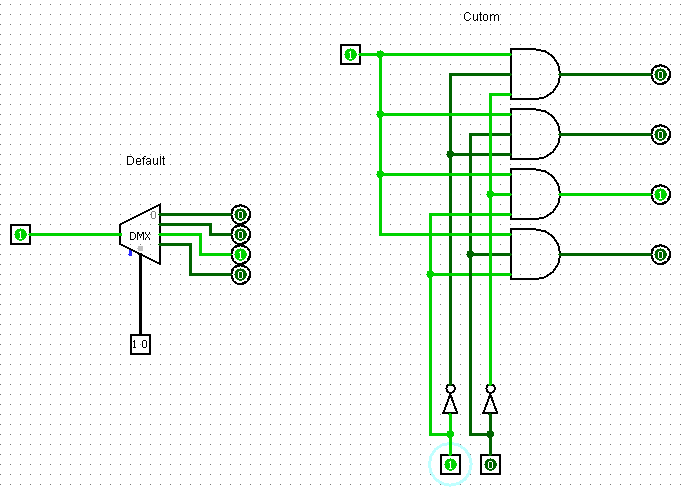
  
<b>Figure 7.2:</b> Demultiplexer

---

# **Practical 8. Design of a 2-Bit Magnitude Comparator**

**Aim**: To compare two 2-bit binary numbers.
**Tasks**
- Implement and simulate a 2-bit magnitude comparator using logic gates.
- Test the circuit with different pairs of binary inputs to verify the comparison results.

**8.1. Simple 1-Bit Comparator**

Comparator determines whether one binary number is greater than, less than, or equal to another. Logic gates generate outputs for A>B, A<B, and A=B conditions.
Here's the **truth table** for a 1-bit comparator

| A   | B   | A > B | A < B | A = B |
| --- | --- | ----- | ----- | ----- |
| 0   | 0   | 0     | 0     | 1     |
| 0   | 1   | 0     | 1     | 0     |
| 1   | 0   | 1     | 0     | 0     |
| 1   | 1   | 0     | 0     | 1     |

  
  
<b>Figure 8.1:</b> 1-bit Comparator

**8.2. 2-bit magnitude comparator**

Here’s the **truth table** for a 2-bit magnitude comparator that compares two 2-bit numbers A (A1 A0) and B (B1 B0) and gives outputs for A > B, A < B, and A = B:

| A1  | A0  | B1  | B0  | A > B | A < B | A = B |
| --- | --- | --- | --- | ----- | ----- | ----- |
| 0   | 0   | 0   | 0   | 0     | 0     | 1     |
| 0   | 0   | 0   | 1   | 0     | 1     | 0     |
| 0   | 0   | 1   | 0   | 0     | 1     | 0     |
| 0   | 0   | 1   | 1   | 0     | 1     | 0     |
| 0   | 1   | 0   | 0   | 1     | 0     | 0     |
| 0   | 1   | 0   | 1   | 0     | 0     | 1     |
| 0   | 1   | 1   | 0   | 0     | 1     | 0     |
| 0   | 1   | 1   | 1   | 0     | 1     | 0     |
| 1   | 0   | 0   | 0   | 1     | 0     | 0     |
| 1   | 0   | 0   | 1   | 1     | 0     | 0     |
| 1   | 0   | 1   | 0   | 0     | 0     | 1     |
| 1   | 0   | 1   | 1   | 0     | 1     | 0     |
| 1   | 1   | 0   | 0   | 1     | 0     | 0     |
| 1   | 1   | 0   | 1   | 1     | 0     | 0     |
| 1   | 1   | 1   | 0   | 1     | 0     | 0     |
| 1   | 1   | 1   | 1   | 0     | 0     | 1     |

  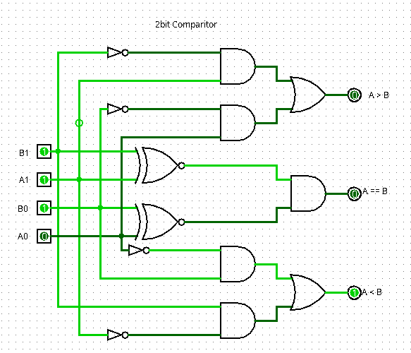
  
<b>Figure 8.2:</b> 2-bit Comparator

---

# **Practical 9. Sequential Circuits: Flip-Flops**

**Aim**: To understand memory elements using flip-flops.
**Tasks**
- Design and simulate basic flip-flops (SR, D, JK) using Logisim.
- Test the behavior of each flip-flop with different input sequences.

Flip-flops are sequential circuits where output depends on present input and previous output. They store one bit of data and change state only when clock pulse is applied. This experiment explains basic memory operation.

Flip - Flop is single transistor that store the state of input as on or off based on power.

**9.1. SR Flip-Flop (Clocked)**

| S   | R   | Q(t) | Q(t+1) | Description       |
| --- | --- | ---- | ------ | ----------------- |
| 0   | 0   | 0    | 0      | No change         |
| 0   | 0   | 1    | 1      | No change         |
| 0   | 1   | 0    | 0      | Reset             |
| 0   | 1   | 1    | 0      | Reset             |
| 1   | 0   | 0    | 1      | Set               |
| 1   | 0   | 1    | 1      | Set               |
| 1   | 1   | 0    | X      | Invalid/Forbidden |
| 1   | 1   | 1    | X      | Invalid/Forbidden |

  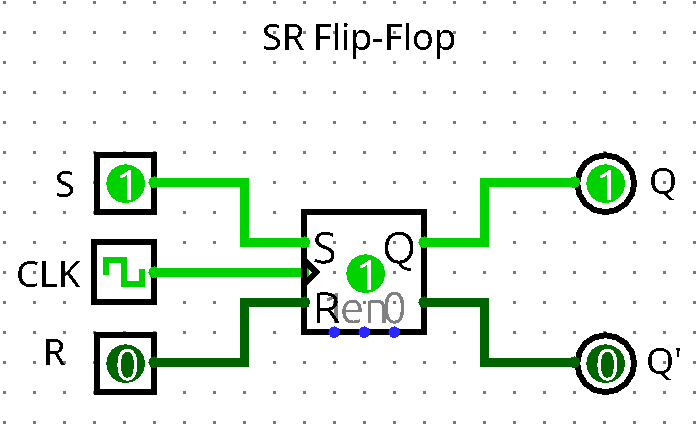
  
<b>Figure 9.1:</b> SR Flip-Flop

**9.2. D Flip-Flop (Data/Delay Flip-Flop)**

| D   | Q(t) | Q(t+1) | Description     |
| --- | ---- | ------ | --------------- |
| 0   | 0    | 0      | Holds 0         |
| 0   | 1    | 0      | Q follows D (0) |
| 1   | 0    | 1      | Q follows D (1) |
| 1   | 1    | 1      | Holds 1         |

  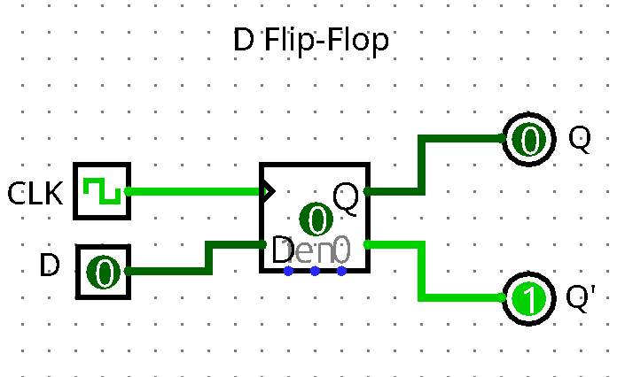
  
<b>Figure 9.2:</b> D Flip-Flop

---

**9.3. JK Flip-Flop (Clocked)**

| J   | K   | Q(t) | Q(t+1) | Description |
| --- | --- | ---- | ------ | ----------- |
| 0   | 0   | 0    | 0      | No change   |
| 0   | 0   | 1    | 1      | No change   |
| 0   | 1   | 0    | 0      | Reset       |
| 0   | 1   | 1    | 0      | Reset       |
| 1   | 0   | 0    | 1      | Set         |
| 1   | 0   | 1    | 1      | Set         |
| 1   | 1   | 0    | 1      | Toggle      |
| 1   | 1   | 1    | 0      | Toggle      |

  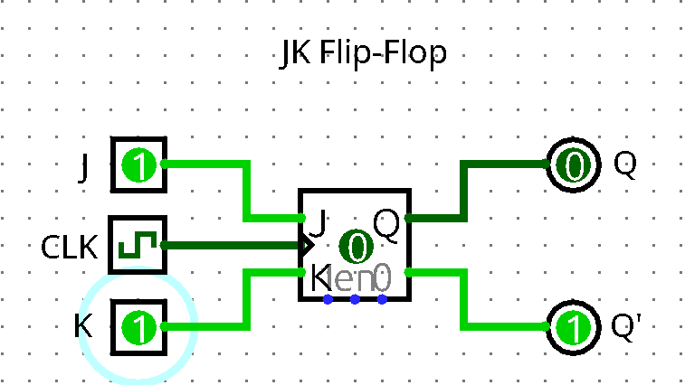
  
<b>Figure 9.3:</b> JK Flip-Flop

---

# **Practical 10. 4-Bit Binary Counter**

**Aim**: To design a circuit that counts binary numbers.
**Tasks**
- Design and simulate a 4-bit binary counter using D flip-flops.
- Observe and record the counting sequence in Logisim.

Counter changes its state on every clock pulse. Using flip-flops, the circuit counts from 0000 to 1111 and then repeats. This practical shows sequential operation clearly.

  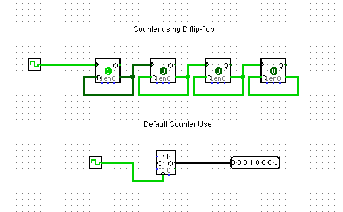
  
<b>Figure 10.1:</b> Custom 4-bit Counter / Default 8bit Counter

---

# **Practical 11. Shift Register Design**

**Aim**: To shift data left and right using shift register.
**Tasks**
- Implement a 4-bit shift register using D flip-flops.
- Simulate the shift left and shift right operations in Logisim.

Shift register moves binary data one bit at a time on each clock pulse. It is useful in data transfer, serial communication, and temporary storage.

**Left Shift:** it move all bit list to left. all left going bit after limit it gone, and new coming from right side are come-up with 0 as default value.
**Right Shift:** it move all bit list to right. all right going bit after limit it gone, and new coming from left side are come-up with 0 as default value

  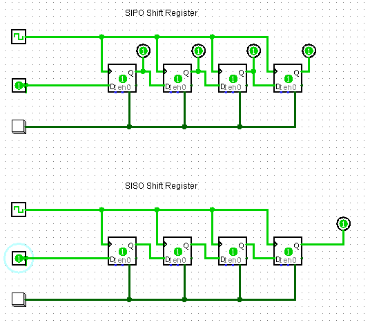
  
<b>Figure 11.1:</b> Shift Register

---

# **Practical 12. Memory Simulation: RAM Module**

**Aim**: To understand read and write operations of RAM.
**Tasks**
- Design and simulate a simple RAM module in Logisim.
- Test read and write operations to the RAM module with different addresses.

RAM is volatile memory used for temporary data storage. Data is stored at specific address locations. In this practical, data is written using write enable signal and read back using read operation. This explains how main memory works in computer systems.

Memory data is access as hexadecimal it make possible process  best volume of data.
based on data type and logic programming of Memory we can store any type of data like Document file, Media file, number, string in storage level.

In this Logisim RAM Model there is 2 control input that i know one select that enable RAM to read and second is Clear to clear RAM (Like Power is Gone in real RAM).

  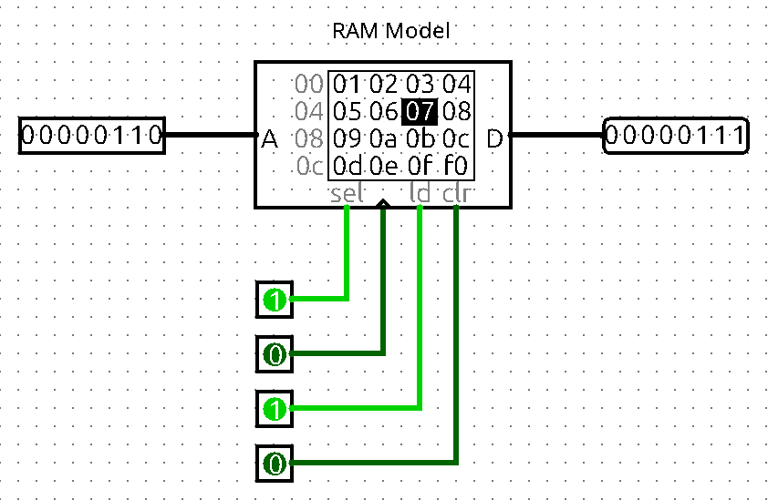
  
<b>Figure 12.1:</b> Ram Model

